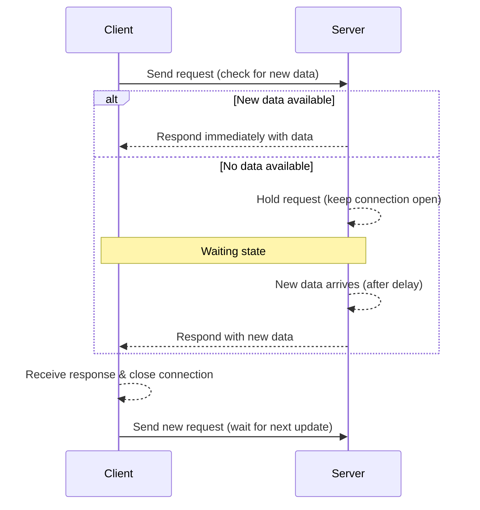

# 03. Long Polling

Long Polling is an important evolution from Short Polling. It solves the biggest drawback of Short Polling: **wasting requests and receiving empty/stale responses**.

---

## 1. How Long Polling Works

If Short Polling is like a child asking every 2 seconds:  
*"Mom, is the rice ready yet? – Not yet."*  

Then Long Polling is like asking once:  
*"Mom, is the rice ready?"* and **standing there waiting until it’s ready**.

**Flow:**
1. The client sends a normal request to the server.
2. The server receives the request:
   - If there **IS** new data → respond immediately (same as REST/Short Polling).
3. If there is **NO** new data:
   - The server **does NOT respond immediately**.
   - It keeps the request open (holds the connection).
4. Both client and server stay in a waiting state.
5. When new data arrives (after 10s, 30s, etc.):
   - The server immediately responds using the held request.
6. The client receives the response → connection closes.
7. The client instantly sends a new request to wait for the next update.

---

## 2. Pros & Cons

### ✅ Advantages (vs Short Polling)
- **Near real-time:** Data is delivered immediately when available, with very low latency.
- **Reduced bandwidth usage:** No more constant request spamming. A single request can stay open for 30–60 seconds.
- **No complex infrastructure required:** Still plain HTTP, works with traditional proxies/firewalls.

### ❌ Disadvantages (Why WebSocket/SSE exist)
- **High server resource usage:** Holding thousands of open connections consumes significant memory.  
  (Less of an issue in Node.js due to event loop, but heavy in thread-based systems like old Java/PHP.)
- **HTTP overhead still exists:** Each request/response still carries full HTTP headers.
- **Timeout issues:**
  - Browsers/proxies often close idle connections after ~30–60 seconds.
  - Servers may need to send periodic “keep-alive” responses.

---

## 3. When to Use Long Polling

- When you need real-time features but **WebSocket is blocked** (e.g., corporate proxies/firewalls).
- When you need compatibility with **older browsers**.
- In practice, libraries like **Socket.IO** often start with Long Polling and upgrade to WebSocket when possible.
