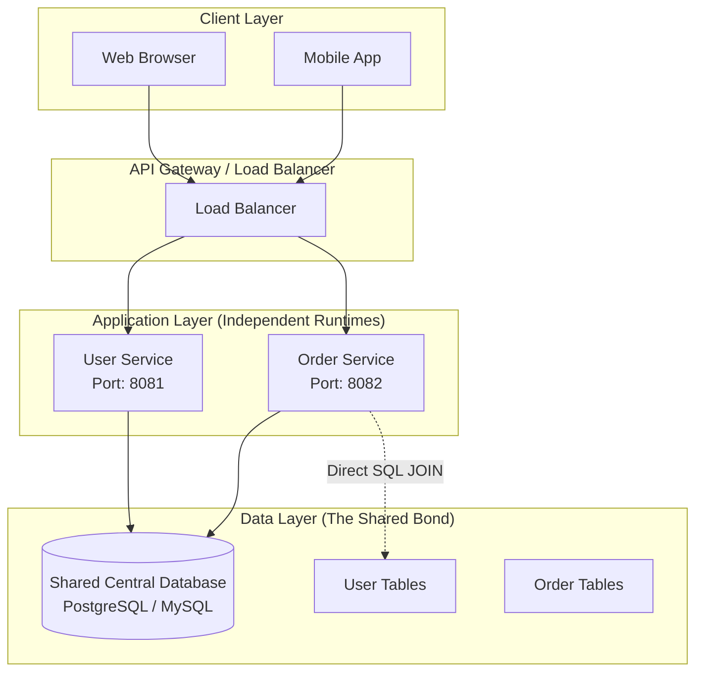

# 02. Service-Based Architecture (Shared Database)

**Service-Based Architecture (SBA)**, often referred to as **"Macro-services"**, is the pragmatic middle ground between a traditional Monolith and a fully distributed Microservices architecture.

In this architectural style, the application is decomposed into several independent, domain-driven services, but they all still point to a **single, shared database**.

---

## 1. Core Characteristics

- **Independent Deployment Units:** Each service (e.g., User Service, Order Service) is a separate process/container and can be deployed independently.
- **Coarse-Grained Services:** Unlike Microservices, which can be very tiny, services in SBA are usually larger and cover entire business domains.
- **Shared Database:** This is the defining feature. While services have their own codebases and runtimes, they interact with the same database schema.
- **Direct Data Access:** Services can "reach across" and query tables owned by other services using standard SQL `JOINs`.

---

## 2. Comparison: The Evolution Path

| Feature            | Monolithic (01)           | Service-Based (02)      | Microservices (03)          |
| :----------------- | :------------------------ | :---------------------- | :-------------------------- |
| **Code Structure** | Single Repo / Single Unit | Multiple Large Services | Many Small Services         |
| **Database**       | 1 Central DB              | **1 Shared DB**         | N Databases (1 per service) |
| **Consistency**    | ACID Transactions         | ACID Transactions       | Eventual Consistency        |
| **Complexity**     | Low                       | Medium                  | **Very High**               |
| **Deployment**     | All-or-nothing            | Per Service             | Per Service                 |
| **Data Coupling**  | High                      | **High (Schema-level)** | None (API-level)            |

---

## 3. Why Choose Service-Based Architecture?

Most organizations adopt SBA during their growth phase as a "stepping stone" to Microservices.

### ✅ The Advantages (Pros)

1.  **Independent Scalability:** You can scale the "Order Service" horizontally without touching the "User Service."
2.  **Simplified Data Integrity:** Since there is only one database, you can still use standard SQL Transactions (ACID) to ensure data stays consistent across services.
3.  **Easier Reporting:** Generating reports is simple because all data resides in one place; no need for complex data aggregation across multiple databases.
4.  **Team Autonomy:** Different teams can own different services, leading to faster development cycles.

### ❌ The Challenges (Cons)

1.  **Shared Database Bottleneck:** The database remains a single point of failure. If the DB goes down, the entire system fails.
2.  **Schema Fragility:** If one team changes a table structure (e.g., renaming a column), it might break other services that depend on that table.
3.  **Connection Pooling:** Managing database connections becomes difficult as the number of services increases, potentially exhausting the DB's connection limit.
4.  **Deployment Deadlocks:** Sometimes a change in the database requires all services to be deployed at the same time, defeating the purpose of independent deployment.

---

## 4. When to Use

- When you want to transition away from a **Monolith** but aren't ready for the operational overhead of **Microservices** (e.g., Saga patterns, Distributed Tracing).
- When your business logic is split, but your data is **highly relational** and requires strict consistency.
- For small to medium-sized teams (10-30 developers) where cross-team coordination is still manageable.

---
