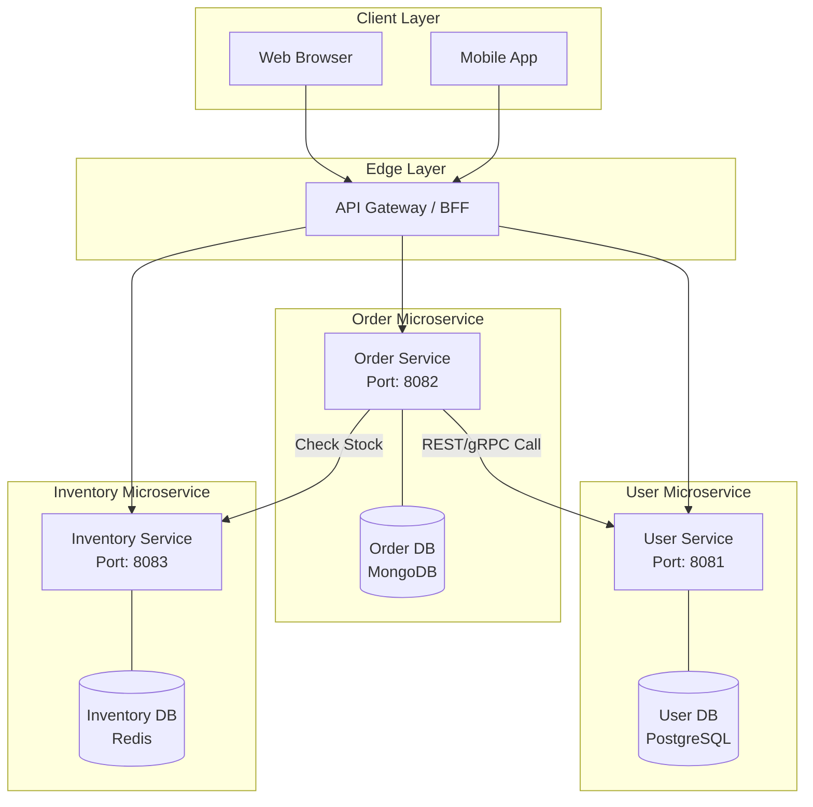

# 03. Microservices Architecture (Database-per-Service)

**Microservices Architecture** is the ultimate stage of system evolution. In this model, an application is a collection of small, autonomous services modeled around a business domain. The golden rule here is: **Encapsulation of Data.**

## 1. The Core Principle: Database-per-Service

Unlike **Service-Based (02)**, where services share a database schema, in a true Microservices architecture, each service has its own private database.

- No service can access another service's database directly.
- Data exchange happens **exclusively** through well-defined APIs (REST, gRPC) or Events (Message Brokers).

---

## 2. Architecture Comparison

| Feature              | Service-Based (02)  | Microservices (03)                |
| :------------------- | :------------------ | :-------------------------------- |
| **Isolation**        | Logical (Code only) | **Physical (Code + Data)**        |
| **Database**         | 1 Shared Database   | **N Private Databases**           |
| **Communication**    | Direct SQL / API    | **API / Events Only**             |
| **Data Integrity**   | ACID (Easy)         | **Eventual Consistency (Hard)**   |
| **Scaling**          | Scalable Services   | **Scalable Services & Databases** |
| **Operational Cost** | Medium              | **Very High**                     |

---

## 3. Why Move to Microservices?

### ✅ The Advantages (Pros)

1.  **Fault Isolation:** If the `User Database` crashes, the `Catalog Service` can still function, allowing users to browse products.
2.  **Polyglot Persistence:** Different services can use different DB technologies (e.g., `Order` uses PostgreSQL, `Recommendation` uses Neo4j Graph DB).
3.  **Team Autonomy:** Teams are truly independent. They own the full stack from API to Database.
4.  **Granular Scaling:** You can scale only the databases that are under heavy load.

### ❌ The Challenges (Cons)

1.  **Data Consistency:** Standard SQL `JOINs` are impossible. You must implement patterns like **Saga** or **API Composition**.
2.  **Network Latency:** Every cross-service request travels over the network, adding overhead.
3.  **Observability:** Debugging requires Distributed Tracing (e.g., Jaeger, Zipkin) to follow a request through multiple services.
4.  **Complexity:** Requires a robust DevOps culture and automated CI/CD pipelines.

---

## 4. When to Use

- When the organization has hundreds of developers split into many teams.
- When parts of the system require extreme scalability that a single database cannot handle.
- When different business modules have drastically different data storage requirements.

---