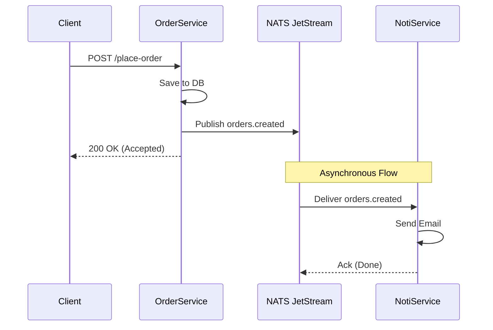

# 04. Event-Driven Architecture (EDA)

**Event-Driven Architecture (EDA)** is a software architecture pattern promoting the production, detection, consumption of, and reaction to events.

In a Request-Response model (03), services are tightly coupled in time: Service A calls Service B and **waits** for a reply. In EDA, Service A simply shouts: _"Hey, an Order was created!"_ and moves on.

## 1. Core Concepts

- **Event:** A record of something that has happened (e.g., `OrderCreated`, `PaymentFailed`). Events are immutable (cannot be changed).
- **Producer (Publisher):** The service that emits the event.
- **Consumer (Subscriber):** The service(s) that listen for and react to events.
- **Message Broker:** The middleman that stores and routes events (e.g., Kafka, RabbitMQ, NATS).

---

## 2. Comparison: Request-Response vs. Event-Driven

| Feature              | Request-Response (03)        | Event-Driven (04)                      |
| :------------------- | :--------------------------- | :------------------------------------- |
| **Coupling**         | Tight (A must know B exists) | **Loose** (A doesn't know who listens) |
| **Flow**             | Synchronous (Waiting)        | **Asynchronous** (Fire and Forget)     |
| **Availability**     | If B is down, A fails        | **Resilient** (B can process later)    |
| **Consistency**      | Strong/Immediate             | **Eventual Consistency**               |
| **Data Aggregation** | N+1 API Calls (Slow)         | **Data Materialization** (Fast)        |

---

## 3. Solving the Data Aggregation Problem

In the previous module (03), we saw that `Order Service` had to call `User Service` every time to get a username.

**With EDA:**

1.  `User Service` emits a `UserUpdated` event whenever a name changes.
2.  `Order Service` listens to this event and **updates a local copy** of usernames in its own database.
3.  When a user views an order, `Order Service` has all the data locally. **No network calls needed.**

---

## 4. Pros and Cons

### ✅ Pros

1.  **High Scalability:** Producers and Consumers can scale independently.
2.  **Responsiveness:** Users don't wait for long background tasks (like sending emails).
3.  **Extensibility:** You can add a new `Analytics Service` to listen to existing events without changing the `Order Service` code.

### ❌ Cons

1.  **Complexity:** Monitoring "what happened when" is harder.
2.  **Eventual Consistency:** Data might be slightly out of sync for a few milliseconds/seconds.
3.  **Duplicate Events:** You must handle the same event being delivered twice (**Idempotency**).

---