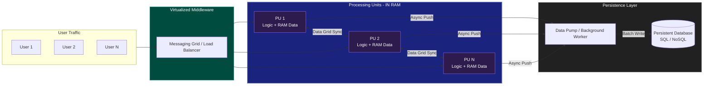

# 05. Space-Based Architecture (SBA)

**Space-Based Architecture** is designed to achieve **extreme scalability** by eliminating the central database as a synchronous bottleneck. It follows the "tuple space" paradigm where data and processing are co-located in memory.

## 1. The Core Problem: The Database Bottleneck
In traditional architectures (Monolith or Microservices), as user traffic grows, the central database eventually becomes the bottleneck (Disk I/O, Lock contention). Even with scaling services, the DB remains a single point of congestion.

## 2. The Solution: In-Memory Data Grid (IMDG)
SBA solves this by moving all active data into **RAM**. 
*   **Processing Unit (PU):** A self-contained unit that holds both the business logic and a subset of the data in-memory.
*   **Virtualized Middleware:** Coordinates the PUs, manages data replication, and handles request routing.
*   **Data Pump:** Asynchronously pushes data from RAM to the persistent database (Write-behind pattern).

---

## 3. Architecture Components

1.  **Processing Unit (PU):** The application code + In-memory data grid.
2.  **Messaging Grid:** Orchestrates request distribution to the PUs.
3.  **Data Grid:** Synchronizes data between PUs (e.g., using Hazelcast, Ignite, or Redis).
4.  **Processing Grid:** Manages parallel processing of complex tasks.
5.  **Deployment Manager:** Dynamically scales PUs based on load.

---

## 4. Pros and Cons

### ✅ Advantages
*   **Near-Infinite Scalability:** Add more RAM-based nodes to handle millions of concurrent users.
*   **Ultra-Low Latency:** Millisecond response times by avoiding Disk I/O.
*   **High Availability:** The system stays alive even if the persistent database is down.

### ❌ Disadvantages
*   **High RAM Cost:** Keeping large datasets in memory is expensive.
*   **Data Loss Risk:** If all PUs crash before the Data Pump syncs, some data might be lost.
*   **Eventual Consistency:** Persistent storage lags behind the in-memory state.

---

## 5. Use Cases
*   **Flash Sales:** (e.g., Shopee 11/11, Taylor Swift Ticket Sales).
*   **Stock Trading:** High-frequency trading platforms.
*   **Online Gaming:** Massive Multiplayer Online (MMO) games.