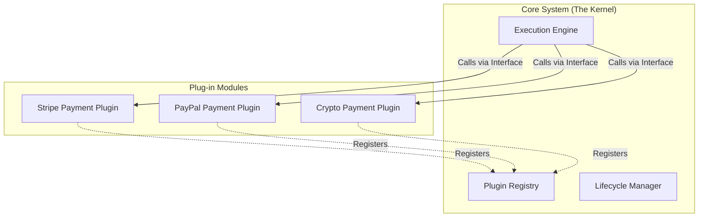

### 04. Microkernel Architecture

**The "Plug-in" Strategy for Systems**

---

#### Core Concept

- **The Kernel (Core):** Minimal logic to run the system. Manages lifecycles and registration.
- **The Plug-ins:** Independent modules for specific features (Stripe, PayPal, etc.).
- **The Contract:** A strict **Interface** that plugins must follow to be "pluggable."

---

#### Design Pattern Relation

- **Macro-level:** It is essentially the **Strategy** and **Factory** patterns scaled up to govern the **entire application structure**.

---

#### Key Features

- ✅ **Extensible:** Add features without touching or recompiling the Core.
- ✅ **Isolated:** If a plugin crashes, the Core ideally stays alive.
- ✅ **Custom:** Users pick and choose which "extensions" to install.
- ❌ **Complex:** Extremely hard to design a "perfect" Interface that never needs to change.

---

#### Real-world Examples

- **IDEs:** VS Code, IntelliJ, Eclipse.
- **Browsers:** Chrome/Firefox Extensions.
- **OS:** Linux/Windows Kernels (Drivers).

---
