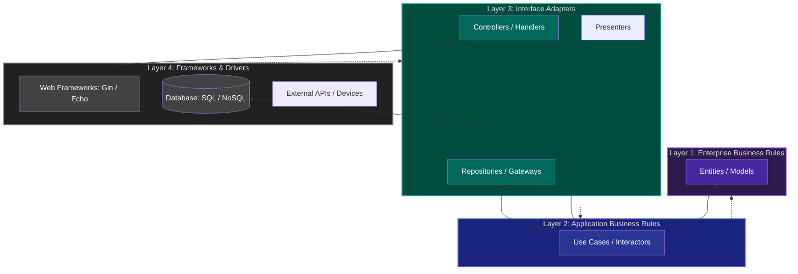

# 05. Clean Architecture (The Onion Architecture)

**Clean Architecture** is a software design philosophy that separates the elements of a design into ring-level groups. The main rule is **The Dependency Rule**: source code dependencies can only point **inward**, towards the center of the onion.

## 1. The Four Layers (The Circles)

1.  **Entities (Core):** Business objects of the application. They encapsulate the most general and high-level rules. They are least likely to change when something external changes.
2.  **Use Cases:** Contains application-specific business rules. It orchestrates the flow of data to and from the entities.
3.  **Interface Adapters:** Converts data from the format most convenient for use cases/entities to the format most convenient for external agencies (Database, Web). This is where **Repositories** and **Controllers** live.
4.  **Frameworks & Drivers (External):** The outermost layer, composed of tools like Databases, Web Frameworks, Devices, etc.

---

## 2. The Dependency Rule

- **Inward only:** Code in an inner circle cannot know anything about code in an outer circle.
- **Abstraction:** To talk to an outer layer, the inner layer defines an **Interface**, and the outer layer implements it (Dependency Inversion).

---

## 3. Why Use Clean Architecture?

### ✅ Advantages

- **Independent of Frameworks:** You don't have to rely on a specific library.
- **Testable:** Business rules can be tested without the UI, Database, or any other external element.
- **Independent of UI:** The UI can change easily (e.g., from Web to Mobile) without changing the business logic.
- **Independent of Database:** You can swap SQL for MongoDB or any other storage easily.

### ❌ Disadvantages

- **High Complexity:** Requires many layers, interfaces, and data mappers (DTOs).
- **Boilerplate:** Even simple features require a lot of files.
- **Overkill:** Not recommended for simple CRUD applications.

---

## 4. Real-world Example

- Banking systems where core transaction logic must be 100% bug-free and independent of whether the customer uses an ATM, a Web App, or a Mobile App.
