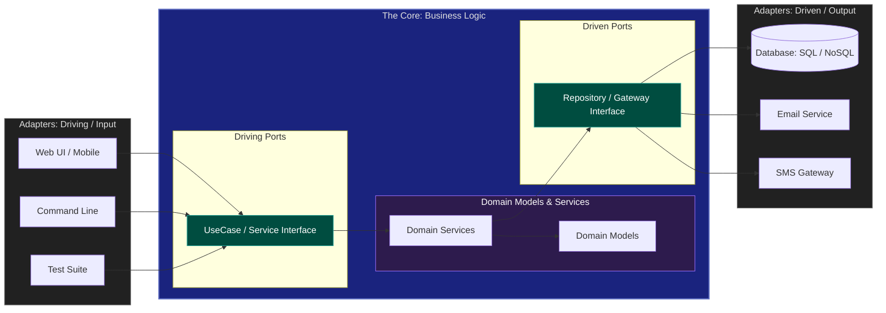

# 06. Hexagonal Architecture (Ports & Adapters)

**Hexagonal Architecture**, created by Alistair Cockburn, aims to create loosely coupled application components that can be easily connected to their software environment by means of ports and adapters.

## 1. The Core Philosophy: Inside vs. Outside

*   **The Inside (The Core):** Contains the Business Logic and Domain Models. It is agnostic to any external technology (Database, Framework, UI).
*   **The Outside:** Contains the Database, UI, External APIs, Frameworks, etc. These are considered "details" that can be swapped.

## 2. Ports and Adapters

1.  **Ports (Interfaces):** The "sockets" through which the Core communicates with the outside world.
    *   *Driving Ports (Primary):* Interfaces for the outside to call into the Core (e.g., Service interfaces).
    *   *Driven Ports (Secondary):* Interfaces for the Core to call the outside (e.g., Repository interfaces).
2.  **Adapters (Implementations):** The "plugs" that fit into the ports.
    *   *Input Adapters (Driving):* HTTP Handlers, CLI, Test Suites.
    *   *Output Adapters (Driven):* SQL Database, In-memory Cache, External Mail Service.

### 3. 🏗️ Hexagonal Architecture Diagram (Dark Mode)

---

## 4. Why Hexagonal Architecture?

### ✅ Advantages
*   **Technology Agnostic:** You can change your database or web framework without touching a single line of business logic.
*   **High Testability:** You can test the Core by plugging in "Mock Adapters" instead of real databases or APIs.
*   **Maintainability:** Clear boundaries prevent infrastructure code from leaking into business logic.

---