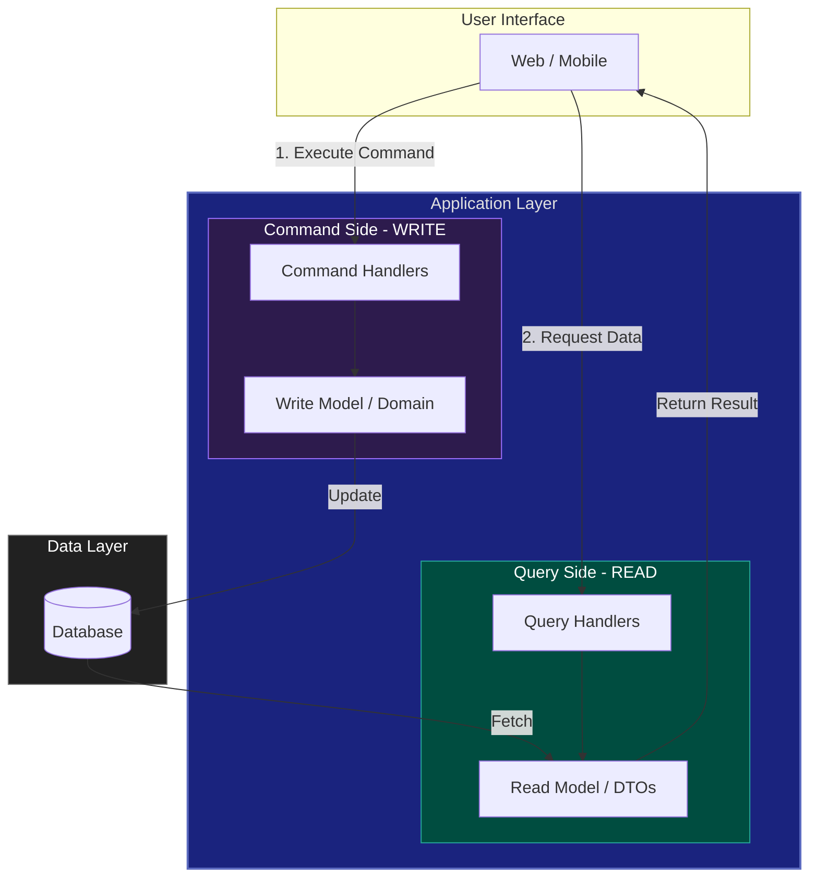

# 07. CQRS (Command Query Responsibility Segregation)

**CQRS** is an architectural pattern that separates the models for updating data (Commands) from the models for reading data (Queries). 

## 1. The Core Concept

*   **Command:** An operation that changes the state of the system (Create, Update, Delete). Commands should not return data (except perhaps a confirmation ID).
*   **Query:** An operation that reads the state of the system. Queries should be side-effect-free (they do not change any data).

## 2. Why Use CQRS?

### ✅ Advantages
*   **Independent Scaling:** You can scale the Read side (which is usually 90% of traffic) independently from the Write side.
*   **Optimized Data Models:** The Read model can be highly optimized for UI display (denormalized), while the Write model is optimized for business logic (normalized).
*   **Security:** Easier to manage permissions (who can change data vs. who can see it).

### ❌ Disadvantages
*   **Complexity:** You have to manage two separate models and potentially two different databases.
*   **Eventual Consistency:** If you use separate databases for Read and Write, there will be a delay (milliseconds) before the Read side sees the update.

---

## 3. Levels of CQRS
1.  **Code-level CQRS:** Separate classes/functions for Commands and Queries but sharing the same DB.
2.  **Database-level CQRS:** Separate databases (e.g., SQL for Write, Elasticsearch for Read).

---